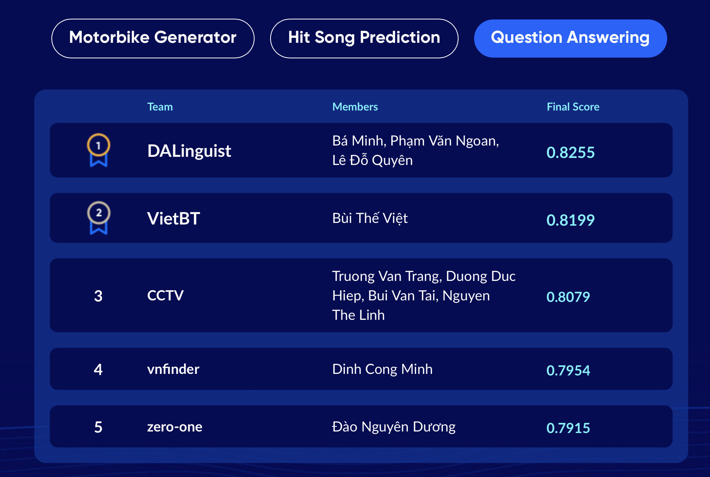
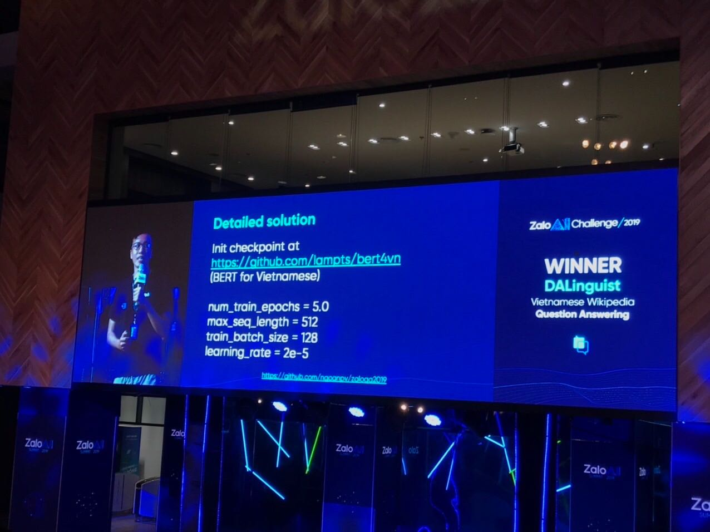

# BERT for Vietnamese

"The brain doesn't have to model the world. The world is its own model." — Hubert Dreyfus (Berkeley Philosopher)

We published the BERT(Multilingual) finetuned for vietnamese as described here:

1. Initialized from BERT-Base, Multilingual Cased (New, recommended): 104 languages, 12-layer, 768-hidden, 12-heads, 110M parameters
2. Pretrained using 110K wordpiece vocab, on 500M+ words of vietnamese news (We don't release this dataset)
3. Fine tuned on Squad2 to get the given checkpoint (step 16289)

You can download it [here.](https://drive.google.com/open?id=169yKntAy8kqPKU0Crl1m5lLjQ3UZYwxZ) 

If it's helpful for you, please give it a star. We gonna release albert4vn ASAP. Keep in touch.

``` bash

***** Eval results *****
global_step = 20000
loss = 0.8570036
masked_lm_accuracy = 0.7956194
masked_lm_loss = 0.8863622
next_sentence_accuracy = 0.98625
next_sentence_loss = 0.04267995

```

## Zalo AI Challenge 2019



- First place solution (using this checkpoint): https://github.com/ngoanpv/zaloqa2019
- 4th place also using this checkpoint, source code is not available yet.



## ALBERT for vietnamese

- Base/Large architecture on vi-wiki (~1m steps): https://github.com/ngoanpv/albert_vi
- 

## References

- https://github.com/google-research/bert/blob/master/multilingual.md
- https://www.tensorflow.org/tfrc
- https://news.zing.vn/zalo-ai-summit-ve-dep-cua-ai-khong-chi-den-tu-thuat-toan-post1025637.html

## License

This is a MIT license.
